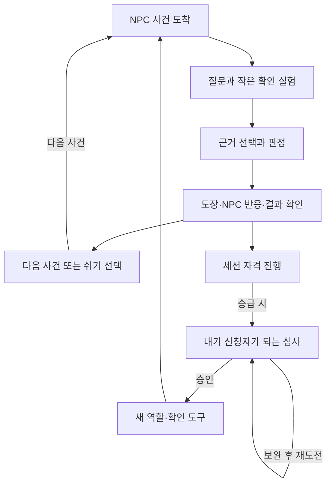

# 참여 폐회로 및 Claude Code 실행 지점

## 제품 목표
수학마을의 공항형 심사대에서 NPC의 주장과 증거를 확인하는 심사관 역할을 즐기게 한다.
승급할 때는 내가 신청자가 되어 앞서 사용한 수학 표현으로 내 행동을 설명한다.
작은 무대에서 역할·판정·연출·성장을 연결한다. 거대한 월드는 필요하지 않다.

## 참여 루프

자격 획득은 향후 구현 목표다. 초기 세션 진행과 지속 저장을 구별한다.
게임 콘텐츠 루프와 운영자의 개선 루프를 같은 것으로 기록하지 않는다.

## 첫 번째 닫힌 작업
범위: 공통 심사대 1개, NPC 좌표 사건 3개, 사건별 짧은 질문 최대 3개, 자료/경로 확인, 판정과 원인 피드백, 자발적 다음 사건.
장소: 스테이징. 기존 작업 파일과 Place 변경을 먼저 확인한다.
미포함: 다주제 사건 대량 생산, 시민권 전체 시스템, DataStore, 결제, 공개 출시, 거대 도시, 자유 생성 대화.
승급 심사는 첫 심사관 루프 다음의 작업이다. 첫 작업에 억지로 같이 넣지 않는다.

첫 사건 구성(예시이며 교사 검수·구현 필요):
| 사건 | 제시된 주장·자료 | 질문으로 얻는 증거 | 올바른 판정 |
|---|---|---|---|
| 정상 배달 | 원점에서 오른쪽 2칸, 위 1칸으로 배달했다 | 경로 재생과 도착 기록이 (2,1)로 일치 | 승인 |
| 좌표 바꿔치기 | 같은 배달 주장이지만 도착 기록이 (1,2) | 출발점과 축 방향을 확인하면 순서 모순이 드러남 | 페이크 반려/퇴장 |
| 출발점 누락 | “오른쪽 2칸, 위 1칸 갔다”는 말만 있고 출발점 없음 | 출발점을 추가 요청하기 전에는 도착 위치를 확정할 수 없음 | 추가 확인 |
상대가 거짓말했는지 확정할 수 없는 사건을 추방 정답으로 만들지 않는다.
고정된 사건 순서/시각으로 답을 외우는 것을 근거 활용으로 세지 않는다.
수학 자료 변주를 만들 때 출발점·이동·도착의 일관성을 확인한다.

## 작업 합격 조건
1. 모바일에서 NPC 등장 → 질문 → 새 자료 → 근거 선택 → 판정 → 결과 → 다음 사건 선택을 끝까지 실행한다.
2. 각 사건의 정답 근거를 자료와 질문에서 찾을 수 있다.
3. 틀린 판정은 빠진 근거와 재확인 행동을 알려주며 플레이어를 추방하지 않는다.
4. 한 번의 판정으로 보상이 중복 지급되지 않고 판정은 서버가 처리한다.
5. 기존 보상/번역/서버 입력 검사를 해당 변경 범위에서 통과한다.
6. 자발적 다음 사건 선택을 관찰할 수 있다. 데이터가 없으면 PENDING_EVIDENCE다.

## 초기 관찰: 이벤트보다 먼저 실제 행동
기존 Analytics와 events 허용목록에 매핑한다. 이 문서의 명칭을 새 이벤트 API로 그대로 생성하지 않는다.
| 연결 | 측정 정의 | 다음 개선 판단 |
|---|---|---|
| 사건 시작 → 첫 질문 | 첫 질문한 세션 / 첫 사건 시작 세션 | 역할과 질문 버튼을 이해하는가 |
| 질문 → 근거 사용 | 제공된 증거와 연결된 근거 선택 / 판정 시도 | 질문이 판단에 도움 되는가 |
| 결과 → 다음 사건 | 자발적 다음 사건 선택 / 다음 사건 선택 화면 도달 | 반복할 재미가 있는가 |
| 실수 → 재확인 | 실수 피드백 뒤 재확인 / 실수 피드백 도달 | 피드백이 회복 행동을 만드는가 |
| 다른 사건 → 표현 재사용 | 다른 맥락에서 같은 표현을 사용한 관찰 수 | 수학 언어 목적이 이어지는가 |
표본·분모·강제/자발 여부를 같이 남긴다. 근거 활용이 추정이면 추정으로 표기한다.
승급 시작/완료와 D1/D7, 결제율은 해당 기능 및 실제 이용자 데이터가 있을 때만 잰다.

## 사람 피드백
한 문장 관찰을 먼저 받는다: “멈춘 장면 / 실제 행동 / 예상과 다른 점”.
AI가 원인을 추정하고 개선 한 가지를 제안한다. 대표가 짧게 교정하면 기존 Evidence에 사실과 가설을 구분해 남긴다.
한 번에 질문 UI, 사건 내용, 결과 연출을 모두 바꾸지 않는다. 가장 큰 단절 하나만 개선한다.

## 다음 단계
첫 루프의 행동과 실제 재참여가 확인되면 같은 주제로 승급 심사 하나를 만든다.
그 뒤 필요한 저장 범위를 결정하고 다음 주제 팩 하나를 연결한다.
승급 조건 숫자, 콘텐츠 수, 성공률 기준은 테스트 근거 없이 확정하지 않는다.
지속 성장은 나중에 구현할 목표이며, 현재 완료 상태와 분리한다.

## 전달된 실행 요청
사용자가 승인한 방향을 읽고 기존 rb 정본과 구현을 읽기 전용으로 대조한다.
새 스킬을 검토하고, 첫 닫힌 작업의 재사용 경로·충돌하는 기존 규칙·가장 작은 변경·필요한 Play 증거를 보고한다.
이번 전달 턴에서는 기존 코드/정본/Studio/저장/결제/배포를 변경하지 않는다.
본격 구현 요청이 오면 같은 스킬로 현재 상태부터 재확인하고 첫 작업 하나를 수행한다.
