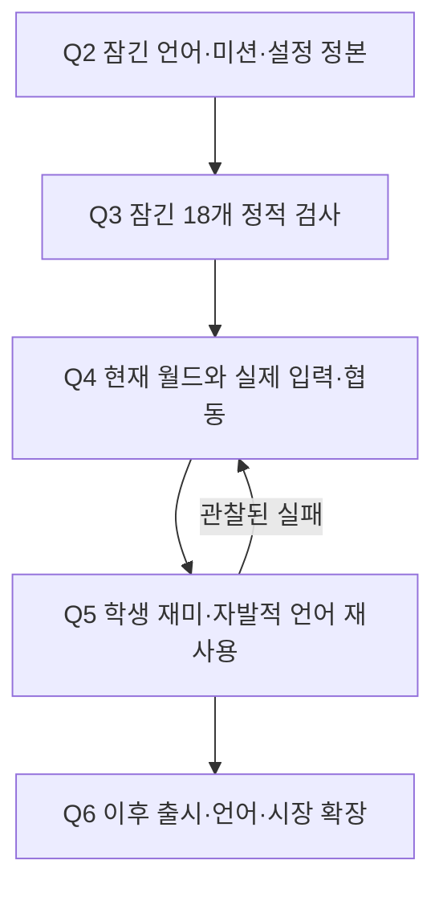

# rb — Neo Seoul 도시 언어 게이트

수학을 잘하지 않아도 위치·변화의 말을 고르고, 친구와 도시를 움직이는 소셜 어드벤처. 정본은 [intent.md](intent.md) r4, 사람 결정은 [decisions.md](decisions.md), 제작 순서와 합격 기준은 [graph.json](graph.json) r11이다.

**현행 개발 기준은 `feat/q2-world-graph@59f56e8`. Q1~Q3 LOCKED, Q4 제작·실행 검증 중.** main에는 이 진행이 아직 반영되지 않았다. Git+Rojo(DEC-8), rb-staging(DEC-2), 플레이어 기록 저장 없음(DEC-12)은 이미 사람이 결정했다. 다시 미결정으로 돌리지 않는다.

## Intent map과 실제 격차



[현재 Q4 검토 지도](reviews/production-r11-Q4.html) · [작은 인계 패킷](reviews/handoff-r11.json) · [환경 실행 증거](outputs/verify/environment/current-drill.json)

현재 원장에는 혼자·키보드 핵심 경로가 Studio에서 포털까지 이어진 관찰이 있다(`PLAY-S5-PORTAL`). Q4-C3는 **FAIL**: 터치·게임패드(S8), NPC/2인(S15), 광장(S16), 힌트(S7), 이벤트(S11), 다른 맥락 재사용(S13), 표현 선택(S14)이 남았다. Q4-C4 시간·C5 실행 UI/오개념/쿨다운과 Q5 재미도 완료 증거가 필요하다. 과거 Studio 기록은 보존한 기록이며 이 세션에서 재실행한 결과가 아니다.

첫 격차는 기존 `ENV-INPUT-1`에 연결한 **S8 입력 경로**다. 같은 기능을 키보드·터치·게임패드로 실행하고 서버에는 동일한 행동 계약을 보낸다. 실제 컨트롤러/터치 검증은 로컬 Studio에서 한다. 이 세션에는 RDC·Studio 도구가 노출되지 않아 로컬 Claude Code가 아래 절차로 재개한다.

## 재사용할 자원

| Intent의 요구 | 이미 있는 공통 자원 | 다음 구현에서 재사용 | 실제 통과 조건 |
|---|---|---|---|
| 언어보다 행동·월드 반응이 먼저 | `Missions.luau`, `MissionService.luau`, `WorldView.luau` | 기존 미션 ID·선행·판정·반응 순서 | Q4-C3/C5·Q5-C2 |
| 어느 기기로도 진행 | `Hud.client.luau`, 기존 RemoteEvent, `Layout.luau` | 입력 어댑터·같은 버튼 Activated/행동 라우터 | 실제 3입력 × solo/2인 완주 |
| 안전하고 공정한 협동 | `RewardService.luau`, `Cooldown.luau`, `remote_contracts.yaml` | 서버 판정·claimOnce·입력 타입/범위/상태 검사 | Q3 고정 결함 + Q4 경쟁/끊김 관찰 |
| 다른 맥락에서도 같은 말 | 잠긴 Q2 월드 Graph·`canonical-values.yaml` | 좌표·기울기 판정과 설정, 맥락 ID | 자발적 선택→행동→결과→term_reused |
| 번역·시장 분리 | `Text.luau`, 생성된 `Localization.csv`, 용어집 | 기존 LocalizationTable 배선·문구 키 | CSV 재생성 일치, Q7 번역 검증 |
| 최소한의 관찰 | `Analytics.luau`, `events.yaml` | 하나의 열거형 이벤트 허용 목록 | 실제 이벤트 경로·횟수·중복 검증 |
| 저비용 시각 제작 | `WorldBuilder.luau`, `WorldView.luau`, `Layout.luau` | 기본 도형 graybox·앵커·공통 반응 | 시각 교체 후 같은 상호작용·거리·서버 계약 |

외부 Package는 출처·사용권·버전·포함 스크립트를 확인하고 스테이징에서 교체한다. 현재 업로드한 외부 Package ID를 새로 주장하지 않는다. 기존 회색 모형과 서비스부터 재사용하고, 제품 테스트가 통과한 뒤 외관을 교체한다. 공식 근거: [Packages](https://create.roblox.com/docs/projects/assets/packages), [외부 자산 검사](https://create.roblox.com/docs/scripting/security/third-party-vulnerabilities), [Studio testing modes](https://create.roblox.com/docs/studio/testing-modes).

## 반복 제작·검증 루프

1. `next`로 현재 유효한 잠금과 실패를 읽는다. 지금 파일·기록의 지문을 인계 패킷과 비교한다.
2. 관찰된 격차 하나를 고르고 위 표의 기존 모듈·설정·문구 키를 사용한다. 새 맥락마다 새 엔진/GUI/분석 서비스를 만들지 않는다.
3. 소스 수정 → 해당 자동 검사 → 로컬 스테이징 Rojo 반영·버전 대조 → 실제 입력과 월드 결과 관찰. 원본 명령·결과·시각·빌드·기기를 기록한다.
4. 수동 기준은 실제 관찰 후 기존 `verify.py observe`로 기록한다. 코드 검사만으로 수동 관찰을 채우지 않는다.
5. 단계 종료 때 자동 검사 → 독립 리뷰 → 6방향 1회 → 현재 버전 사람 승인 → 잠금. 기존 리뷰 상한5회·2회 연속 무개선 멈춤·DEC-18 고정 범위를 유지한다.
6. Q5 실제 학생의 재미·자발적 언어 재사용이 검증된 뒤 출시·언어·시장으로 넓힌다.

```bash
python3 -m venv .venv
source .venv/bin/activate
python3 -m pip install -r requirements.txt
export MASTERWORK_HELPER="<설치된 masterwork/scripts/masterwork.py>"
python3 tools/check.py
python3 tools/verify.py next
python3 tools/verify.py run Q4
python3 tools/verify.py gate Q4
python3 -m harness.run world
```

`check.py`는 설치·승인·잠금을 하지 않으며 누락/빈 suite/생략을 성공으로 세지 않는다. `run`은 검사 없는 기준을 ESCALATE로 남긴다. 보고서는 재실행해도 이전 경로/해시를 덮어쓰지 않는다. 회귀 테스트에 나타나는 승인·잠금 메시지는 임시 fixture다. 실제 상태는 현재 binding의 원장과 gate에서 읽는다.

CI는 명세·월드 소스·고정 결함 검사만 한다. 기존 Masterwork 통합은 로컬 `check.py`, Studio/실제 기기/학생 결과는 Q4/Q5가 맡는다. 도구와 환경을 복제한 새 플래너·DB·서버·상시 에이전트는 없다. 이 패치는 원래 Intent·작업 Graph·사람 결정·게임 소스·고정 Harness를 바꾸지 않는다.

## 로컬 Claude Code 재개

같은 개발 브랜치와 이 PR을 가져온 뒤 `CLAUDE.md`·`docs/02-start-here.md`의 기존 연결 절차를 따른다. `check.py`와 `next`로 Q1~Q3 잠금과 Q4 실패를 확인하고 S8 입력부터 진행한다. Studio 연결과 rb-staging 확인은 실제 도구로 한다. DEC-2/12 결정 자체는 이미 내려졌으며 해당 판정/관찰 기록의 현재 binding 적용은 gate에서 별도로 확인한다.

경제성은 기능/맥락별 공통 코드 변경 수·재사용 자원 수·제작 시간·재작업 시간·검수 비용을 실제 기록으로 본다. 절약한 제작 시간을 입력·협동·플레이테스트에 재투자한다. ROI·매출·재방문 증가 수치는 아직 측정하지 않았다.
